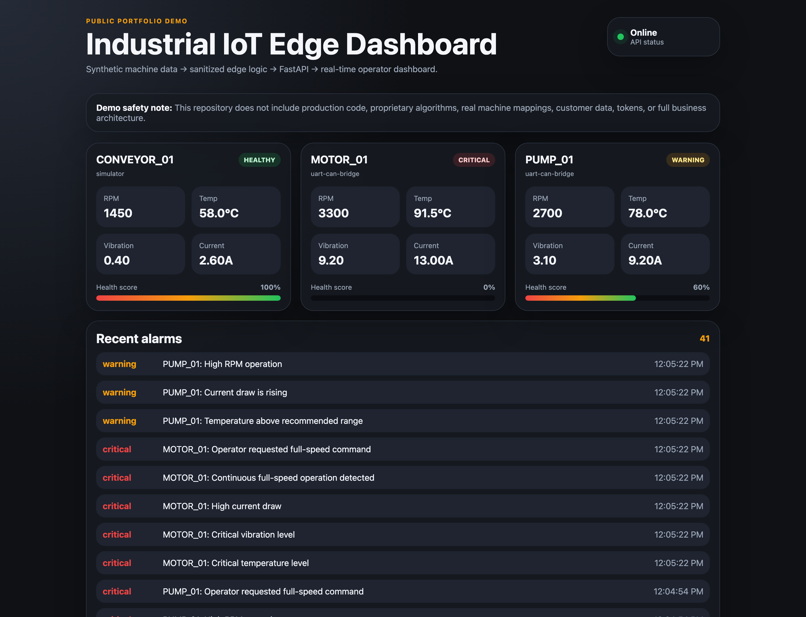
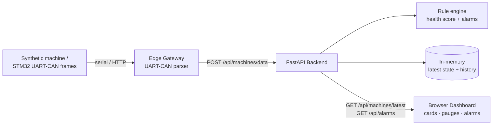

# ⚙️ Industrial IoT Edge Demo

> Synthetic machine data → sanitized edge parser → **FastAPI** backend → **real-time operator dashboard**.
> The public, runnable distillation of my MCT predictive-maintenance thesis.




*Live operator dashboard: per-machine RPM / temperature / vibration / current, health scoring, and a color-coded alarm feed — a healthy conveyor, a warning pump, and a critical motor.*

---

## What it demonstrates

- **FastAPI** ingestion API + a dashboard served from the same app
- A **sanitized edge gateway** that parses STM32-style `UART/CAN` bridge frames (e.g. `<CAN,201,8,5A032A03...>`)
- A **rule-based health/anomaly engine** (temperature, vibration, current, RPM thresholds) producing a 0–100 health score and alarms
- A **real-time dashboard** with machine cards, gradient health bars, and a live alarm log
- A **synthetic data simulator** and **pytest** coverage for the parser

This mirrors the edge + dashboard layer I owned on **MCT**, a CAN-bus predictive-maintenance
platform built and demonstrated on real hardware as my EEE thesis. The real system's CAN
mappings, ML scoring, and cloud architecture are proprietary and intentionally excluded here.

---

## Architecture



---

## Quickstart

```bash
cd industrial-iot-edge-demo
python -m venv .venv && source .venv/bin/activate
pip install -r requirements.txt

uvicorn backend.main:app --reload            # dashboard → http://127.0.0.1:8000
python simulator/machine_simulator.py        # in a second terminal, stream data
```

API docs are auto-generated at `http://127.0.0.1:8000/docs`.

**Optional — parse real UART/CAN hardware:**
```bash
python edge/edge_gateway_demo.py --serial-port /dev/ttyUSB0
```

Run the tests:
```bash
python -m pytest -q
```

---

## Project layout

```text
industrial-iot-edge-demo/
├── backend/
│   ├── main.py        # FastAPI app: ingestion API + dashboard
│   ├── models.py      # Pydantic models (sample, evaluated state, alarm)
│   ├── anomaly.py     # rule-based health/alarm engine
│   └── storage.py     # in-memory latest-state + history
├── edge/
│   └── edge_gateway_demo.py   # UART/CAN bridge parser + poster
├── simulator/
│   └── machine_simulator.py   # synthetic RPM/temp/vibration/current
├── dashboard/         # HTML + CSS + JS operator UI
├── tests/             # pytest (parser)
└── docs/architecture.md
```

---

## Deliberately excluded (kept portfolio-safe)

Real CAN frame mappings · proprietary ML scoring · customer/factory data · secrets & tokens ·
the full MCT cloud architecture. A production build would add auth, persistent storage, audit
logs, signed device identity, and fail-safe/watchdog behavior.

---

Built by **Altan Çetin Çelik** — [GitHub](https://github.com/AltanCetinCelik) · [LinkedIn](https://www.linkedin.com/in/altan-celik-004bb1248/) · altancelik35@gmail.com · [MIT License](../LICENSE)
